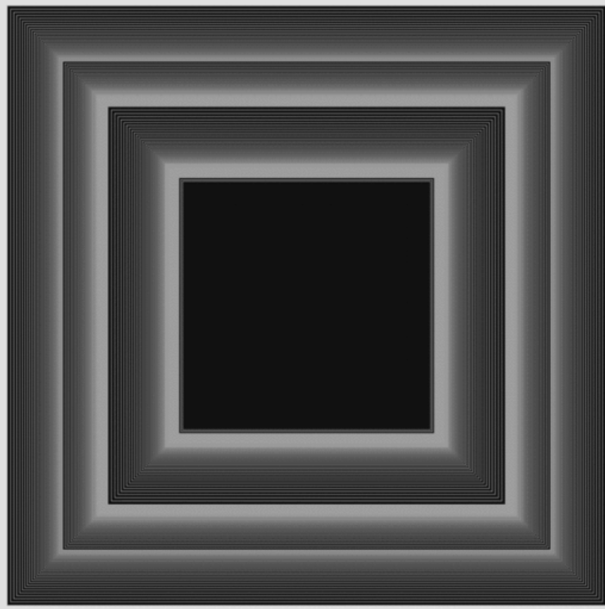

# Creative coding major project
## Individual part: Perlin noise

### 1 Instructions on how to interact with the work

<video controls src="individual work2.mp4" title="Title"></video>
Each time the page is refreshed, the four fixed rectangles wireframes show a regular change. When we resize the page by dragging the window, the wireframes inside the rectangles also display a dynamic animation effect.

### 2 Details of my work
- Perlin noise
- Differences between group members:
  - Xueying Wang’s project adjusts the size of rectangles based on the volume of the music.

  - Ziyue Xu’s work involves mouse interactions that allow users to move, resize, and change the color of rectangles.

  - Yi Wang is responsible for the time events, adding animations for rotating rectangles and sequences in which rectangles appear.

  -  I focused on Perlin noise, creating variations within four fixed rectangles by adding multiple white wireframes to enhance the visual effect.
  
- Inspiratiaon 

 My inspiration came from the example in part 2 of week9's tutorial. Based on this, I used Perlin noise to create layered wireframe effects in the four fixed rectangles, showing a regular change each time the page is refreshed. When resizng the page, the wireframes within the fixed rectangles can produce a dynamic effect. This dynamic  represents the crisscrossing of the city, with pedestrians, buildings, and facilities changing over time. Although the appearance of some buildings remains constant, seemingly untouched by time, their internal structures quietly adapt and adjust, subtly evolving with the passage of years. 

- Technical explanation

In the code, Perlin noise is used to create a regular wireframe change within each fixed frame(NoisyFrame)on each refresh.
1. **Noise offset initialization** 
this.noiseOffset = random(100), Each NoisyFrame initializes a noiseOffset value, which is a random starting point for perlin noise. 
2. **Noise animation update**
this.noiseOffset += 0.01, with each frame update, noiseOffset is incremented by a small amount(0.01).
3. **Drawing Noisy Frames**
drawNoisyFrames(), Inside this function, the Perlin noise values are used to create multiple scaled-down wireframe rectangles within the main rectangle. By adjusting the scale of each rectangle based on the Perlin noise values, we achieve an effect where rectangles' wireframes appear to shrink and expand in an regular motion.
4. **Number of noise effect frames**
let steps = 33, representing how many wireframes in each fixed rectangle.
5. **Noise value mapping**
let scale = map(noiseValue, 0, 1, 1, 0.05), which controls the scale range.
6. **Layered wireframe**
Use for loop to draw multiple fixed rectangles'wireframes, each one slightly smaller than the last, and each positioned with a slight offset. 
